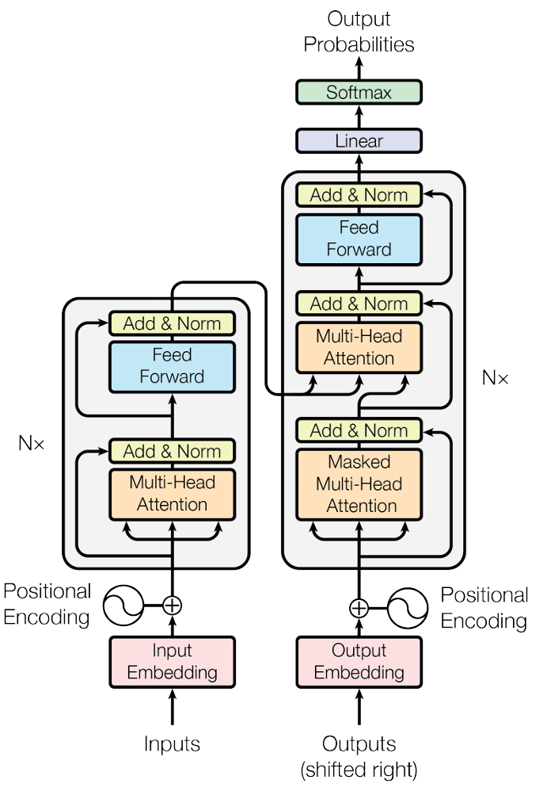

# 手撕模型代码

# 1. Models

## 1.1 Transformer

(1) 知乎文章: [手撕 Transformer（一）：模型实现](https://zhuanlan.zhihu.com/p/1893350154968474154)

(2) 模型结构
    

## 1.2 Llama3

(1) 知乎文章：[手撕 llama3（一）：模型实现](https://zhuanlan.zhihu.com/p/1897941469794375596)

(2) 模型结构
    

# 2. Examples

## 2.1 英译中任务

(1) 知乎文章：[手撕 Transformer（二）：实战英译中任务](https://zhuanlan.zhihu.com/p/1893768077331632606)

(2) 数据集链接：[中英文翻译数据集 - Heywhale.com](https://www.heywhale.com/mw/dataset/60c41b7a19d601001898b34a/content)

## 2.2 Llama3-1B 推理任务

(1) 知乎文章: [手撕 llama3（二）：llama3-1B 模型推理实战](https://zhuanlan.zhihu.com/p/1898064597770019497)
